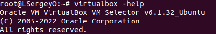
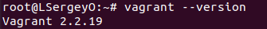
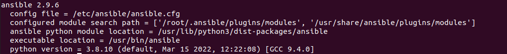

# devops-netology_5.2
1. Позволяет описать инфраструктуру в виде кода и в дальнейшем маштабировать (быстрое создание идентичных систем)  
2. Ansible - open source, понятные playbooks, использует существующую SSH инфраструктуру.  
Pull при большом колличестве серверов. Большая часть работы выполняется агентом на самих серверах.
3. 
  

  

  

4.

